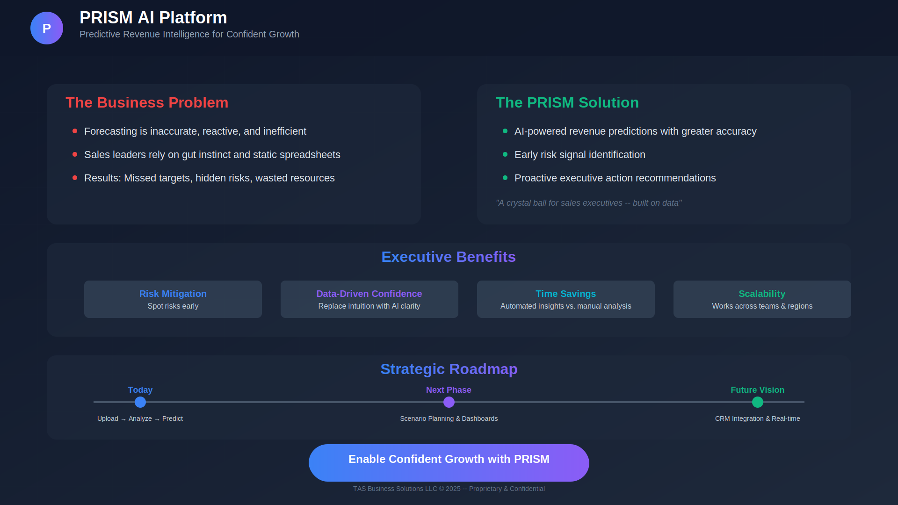

# PRISM: Predictive Intelligence Platform

## Executive Summary

PRISM is a modular AI-powered predictive intelligence platform designed specifically for mid-market healthcare organizations. This project addresses the critical gap in affordable, explainable AI solutions for healthcare companies with $10M-$250M annual revenue.

## Key Value Propositions

- **25% accuracy improvement** in forecasting
- **4.5-6.2x ROI** within 18-20 weeks
- **Explainable AI** with natural language outputs
- **No in-house AI team required**

## Problem Statement

Mid-market healthcare organizations face significant challenges in predictive analytics:

- Poor forecast visibility affecting strategic planning
- Clinical-commercial disconnect hindering operational efficiency
- Manual Excel-based processes limiting scalability
- Late risk identification impacting revenue protection
- Lack of AI talent and high implementation costs

The healthcare AI market is growing to $60B by 2030, but existing solutions are either too complex (enterprise-focused) or too basic (manual processes), leaving a substantial serviceable addressable market gap for mid-market players.

## Solution Architecture

### Core Components

**Input Layer:**
- Sales data (units, price, revenue, discounts)
- ERP system integration
- CRM systems integration
- Reimbursement code data

**ML Processing Engine:**
- Random Forest models
- XGBoost algorithms
- GenAI transformers
- Ensemble methods

**Output Layer:**
- Forecast tables with confidence intervals
- Risk scores and alerts
- Natural language executive summaries
- Interactive dashboard with MAPE metrics

## Key Use Cases

1. **Revenue Forecasting** - Sales volume and regional performance prediction
2. **Risk Detection** - Identifying underperforming territories and usage gaps
3. **Scenario Planning** - Product launch and resource allocation modeling
4. **Payer Alignment** - GenAI summaries for health technology assessment meetings

## Market Positioning

### Competitive Advantages
- AI-native architecture vs legacy system retrofits
- Explainable outputs vs black box solutions
- Mid-market pricing vs enterprise costs
- 18-week deployment vs 12+ month implementations

### Target Market
- **Primary:** Healthcare providers, medical device companies, pharma (50-500 staff)
- **Revenue Range:** $10M-$250M annual recurring revenue
- **Profile:** Growth-stage companies with emerging data-driven culture
- **Decision Makers:** VP of Sales, Clinical Ops Directors, CFO/Finance Leads

## Business Model

The platform operates on a SaaS model with tiered pricing based on organization size and feature requirements. Implementation includes:

- Initial setup and configuration
- Data integration and validation
- Model training and customization
- Ongoing support and optimization

## Project Status

This represents a comprehensive analysis of bringing AI-powered predictive intelligence to underserved mid-market healthcare organizations, with clear value propositions and actionable implementation strategies.

## Technologies Used

- Machine Learning: Random Forest, XGBoost
- AI/NLP: Transformer models for natural language generation
- Data Integration: API connectors for major ERP/CRM systems
- Visualization: Interactive dashboards and reporting

## Contact

For more information about this project or collaboration opportunities:
- Email: prismhealth.ai@outlook.com
- LinkedIn: [Timothy Sharp](https://www.linkedin.com/in/timothy-sharp-9b3a9940/)

---

*This project was developed as part of an academic capstone project, showcasing the application of AI/ML technologies to solve real-world healthcare challenges.*
